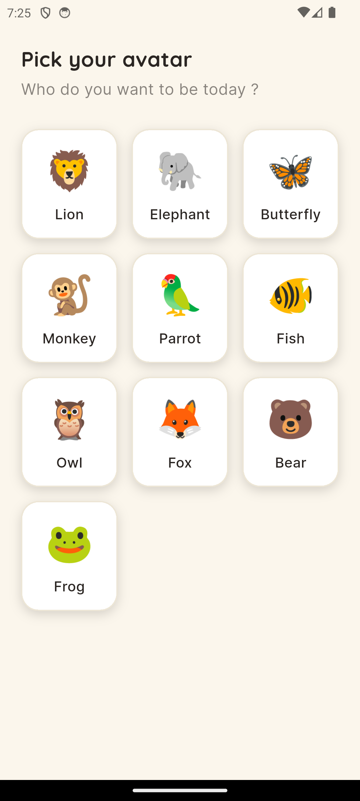
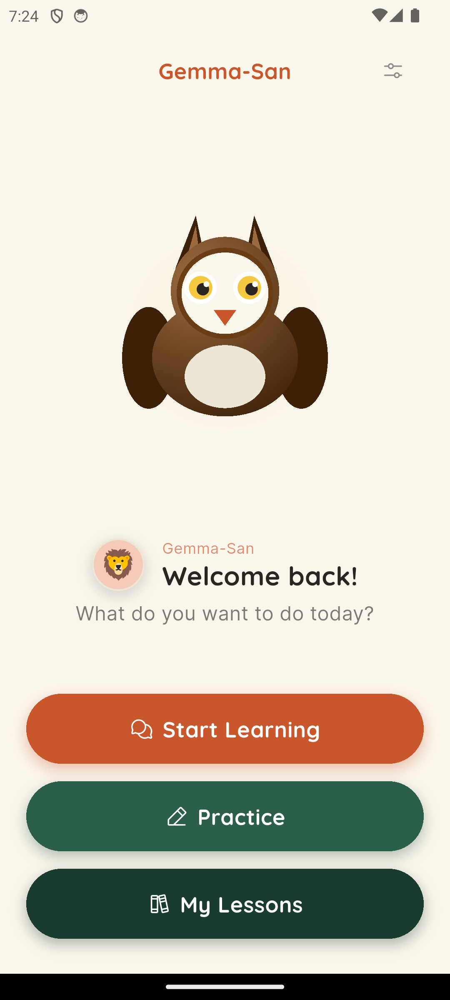
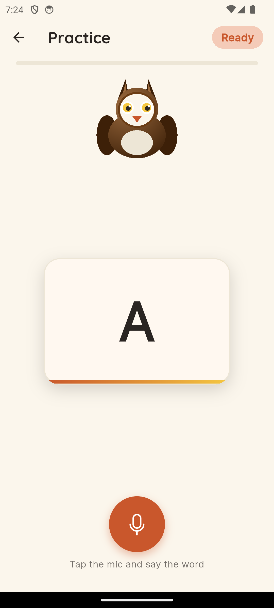
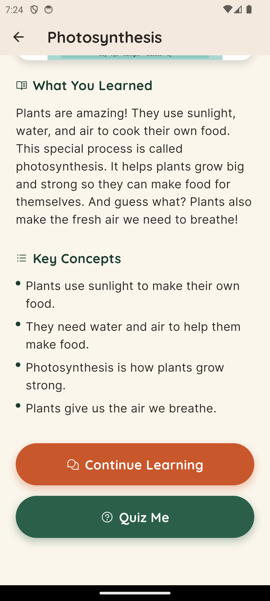

<div align="center">

# Gemma-San

### _When the Internet Ends, the Lesson Begins._

**A patient, voice-first AI tutor that runs Gemma 4 entirely offline on a 4 GB Android phone — built for the 250 million African children the cloud forgot.**

[▶ Watch the demo](https://www.youtube.com/watch?v=FD7dJ33XGXc) · [⬇ Download APK](https://github.com/TheCodeDaniel/gemma_san/releases/download/Initial/app-release.apk) · [🌐 Live site](https://thecodedaniel.github.io/gemma_san/) · [Source](https://github.com/TheCodeDaniel/gemma_san)

</div>

---

## The 30-Second Pitch

Sixty percent of Nigerian primary-school-age children fall below minimum reading proficiency. Most have a phone in the home but **no reliable internet, no tutor, no AI subscription, and no English-as-first-language environment.**

Every AI tutor on the market — Khanmigo, ChatGPT, Duolingo Max — depends on a cloud round-trip and a credit card. None of that survives a rural Nigerian classroom.

**Gemma-San is a complete tutor that fits in a child's pocket.** It listens, thinks, draws, remembers, and speaks back — _all on the device, all the time_, in five Nigerian languages. No internet. No subscription. No data plan. No telemetry.

> **One phone. Five languages. Zero internet.**

---

## The Problem Most AI Tutors Pretend Doesn't Exist

|                                                            |                      |
| ---------------------------------------------------------- | -------------------- |
| **Children of primary-school age in Sub-Saharan Africa**   | 250 M+               |
| **Estimated proportion below minimum reading proficiency** | ~85 % (UNESCO, 2022) |
| **Households with a smartphone in major Nigerian cities**  | ~70 %                |
| **Households with reliable broadband**                     | ~30 %                |
| **Children with access to a one-on-one tutor**             | < 1 %                |

Bloom's 1984 "2-sigma problem" showed that one-on-one tutoring produces learning gains of **two standard deviations** over conventional classroom teaching — a result no scalable intervention has ever matched. AI may finally close that gap, but only if it **reaches the child where the child actually is**: on a basic Android phone, in a language the child speaks at home, without a monthly bill.

That's the gap Gemma-San is built for.

---

## What Gemma-San Actually Does

Gemma-San is a complete app, not a demo. Every feature below is implemented and shipping in the APK:

| Capability                      | How it works                                                                                                                                                                                  |
| ------------------------------- | --------------------------------------------------------------------------------------------------------------------------------------------------------------------------------------------- |
| **Voice in (multilingual)**     | Whisper Tiny via FFI — auto-detects Hausa, Yorùbá, Igbo, Pidgin, English. Runs alongside Gemma in ~1 GB combined.                                                                             |
| **Voice out**                   | Android TTS, Nigerian English voice preferred (`en-NG > en-GB > en-US`), with one-time Google TTS install prompt for the best neural voices.                                                  |
| **Socratic dialogue**           | A 4-step teaching ladder (probe → build → narrow → resolve) grounded in Vygotsky's ZPD and the Khanmigo pedagogical pattern.                                                                  |
| **Direct teaching**             | Triggered when the child explicitly asks "what is X?" or after two "I don't know" signals.                                                                                                    |
| **Live drawing**                | The model generates SVGs on demand for any topic — traffic lights, clocks, rainbows. A custom validator auto-fixes Gemma's quirks (degenerate coordinates, garbled `xmlns`, wrong `viewBox`). |
| **22 hand-built illustrations** | Photosynthesis, human heart, solar system, water cycle, food chain, simple machines… all SVG, all offline.                                                                                    |
| **Three-tier memory**           | Working (current turn) → session summary → cross-session facts. Compacted in a background isolate. The tutor remembers the child's name, hobbies, and prior lessons across days.              |
| **Spaced-repetition phonics**   | Deterministic SRS over a 5-level curriculum. Levenshtein fuzzy match on STT output — instant, no LLM round-trip.                                                                              |
| **Quiz mode**                   | Dedicated tool schema (`quiz_question`), 5 questions per lesson, score summarised at the end.                                                                                                 |
| **Lesson summaries**            | Background `generateLessonSummary` call after each session — child can revisit any past lesson in the history browser.                                                                        |
| **Privacy by design**           | Every conversation, memory, and audio file stays on the child's phone. Zero telemetry.                                                                                                        |

---

## Demo

**▶ Watch on YouTube — https://www.youtube.com/watch?v=FD7dJ33XGXc**

[](https://www.youtube.com/watch?v=FD7dJ33XGXc)

A walkthrough showing:

1. A Nigerian child saying _"Wetin be photosynthesis?"_ in Pidgin
2. Gemma-San probing what the child already knows about plants
3. The teaching ladder escalating after two "I don't know" responses
4. A live illustration of photosynthesis appearing
5. A 5-question quiz, with Pidgin encouragement after a correct answer
6. The child re-opening the app the next day — Gemma-San remembers their name and last lesson

---

## Media Gallery

Real screens from the shipping APK — no mockups, no marketing renders.

| | | | |
|---|---|---|---|
|  |  |  |  |
| **Onboarding** — ten avatars, age-aware curriculum | **Home** — three doors: learn, practice, revisit | **Practice** — phonics drilling, voice-evaluated | **Lesson summary** — child-friendly recap + 5-question quiz |

A full-resolution gallery and additional screens are on the [live site](https://thecodedaniel.github.io/gemma_san/#screens).

---

## Architecture

```
                  ┌──────────────────────────────────────────┐
                  │            Android Phone (4 GB RAM)      │
                  │                                          │
   Child speaks   │   ┌──────────┐    ┌─────────────────┐   │   Child hears
   ─────────────► │   │ Whisper  │───►│   Gemma 4 E2B   │   │ ─────────────►
   (any of 5      │   │  Tiny    │    │  (litert-lm)    │   │  (TTS, Nigerian
   languages)     │   │   STT    │    │ tools=6 + quiz  │   │   English voice)
                  │   └──────────┘    └────────┬────────┘   │
                  │                            │            │
                  │           ┌────────────────┼─────────┐  │
                  │           ▼                ▼         ▼  │
                  │      ┌─────────┐     ┌──────────┐  ┌──────────┐
                  │      │ SQLite  │     │   SVG    │  │  22      │
                  │      │ memory  │     │ validator│  │  static  │
                  │      │ 3-tier  │     │ + auto-  │  │ illustra-│
                  │      │         │     │ sanitize │  │  tions   │
                  │      └─────────┘     └──────────┘  └──────────┘
                  │                                          │
                  └──────────────────────────────────────────┘
                                  ZERO network calls.
```

| Layer             | Stack                                                                                                                                       |
| ----------------- | ------------------------------------------------------------------------------------------------------------------------------------------- |
| UI                | Flutter (Android-only, minSdk 26)                                                                                                           |
| On-device LLM     | `flutter_gemma ^0.15.1` — Gemma 4 E2B / E4B via `ModelType.gemma4`, native function calling                                                 |
| Backend selection | GPU → CPU runtime try-chain (NPU omitted — `.litertlm` weights aren't NPU-compiled; attempting it triggers a 20-second ANR on real devices) |
| STT               | whisper.cpp Tiny model via FFI, `language: 'auto'`                                                                                          |
| TTS               | `flutter_tts` with engine detection (prefers Google TTS for neural voices)                                                                  |
| Storage           | `sqflite` — chat history, memory, profile                                                                                                   |
| Background work   | Dart `Isolate` for anything > 100 ms (memory compaction, lesson summary)                                                                    |
| State             | `flutter_riverpod` only — zero `setState` in business logic                                                                                 |

---

## Pedagogical Foundation

Gemma-San isn't a chatbot with a teacher costume. The system prompt is grounded in three decades of intelligent-tutoring-systems research:

#### Vygotsky's Zone of Proximal Development (ZPD)

The child works on the boundary between _what they can do alone_ and _what they can do with help_. Gemma-San probes first to find that boundary, then scaffolds at exactly the right level — never above, never below.

#### Bloom's 2-Sigma & Mastery Learning

A child who masters each concept before moving on outperforms a child who marches through a curriculum at fixed pace. Gemma-San's SRS practice mode (`practice_service.dart`) tracks per-item mastery and adapts.

#### The Khanmigo Pattern (OpenAI x Khan Academy, 2023)

Khanmigo's published guidelines explicitly forbid the tutor from giving away answers — every turn must guide. Gemma-San implements this as a hard rule:

```
TEACHING LADDER (follow in order — reset when child answers correctly)

STEP 1 — Child gives a wrong or partial answer:
  → socratic_teach (stage=build)
    · Affirm what is correct
    · Add ONE small new fact or hint
    · Ask ONE simpler follow-up question

STEP 2 — Child says "I don't know" OR is still wrong:
  → socratic_teach (stage=narrow)
    · Zoom in to a yes/no or 2-choice question

STEP 3 — Child says "I don't know" again, OR "just tell me":
  → direct_teach
    · Give the full explanation with a Nigerian real-world example
    · End with ONE easy question the child can get right

STEP 4 — After direct_teach and child answers correctly:
  → encourage  (celebrate in Pidgin)
    Then NEXT turn: socratic_teach (stage=resolve) to confirm
```

#### Affective scaffolding

The system prompt explicitly bans the word "wrong". Encouragement is delivered in Nigerian Pidgin ("You do well! Sharp sharp! You get am!") — not because the model couldn't say "Great job!", but because warmth lands differently in a child's mother tongue.

---

## Engineering Highlights

The five decisions I'd most want a judge to look at:

### 1. The teaching ladder is enforced by _tool schema_, not prose

Most prompt-engineered tutors say "be Socratic" in natural language and hope. Gemma-San makes the ladder structural: `socratic_teach` has a required `stage` enum (`probe | build | narrow | resolve`) that maps 1:1 to the four ladder steps. The model can't drift without picking a stage; the stage is logged; mis-stages are debuggable.

> See: [`lib/services/gemma/tool_definitions.dart`](lib/services/gemma/tool_definitions.dart)

### 2. SVG validator that auto-heals Gemma's quirks

E2B and E4B both ship structurally-valid but semantically-broken SVGs — `viewBox="0 0 20 20 20"` (five numbers), garbled namespaces (`w3.3.org/20000/svg`), and `r="1"` circles that render as invisible specks. Rejecting these would kill 50 % of drawing requests.

Instead, `SvgValidator` auto-sanitizes:

- Strips extra `viewBox` numbers and normalises tiny dimensions to 200×200
- Rewrites garbled `xmlns` to the canonical URL
- Detects degenerate coordinates (every circle `r < 5`, every rect <10×10) and falls back to a text explanation rather than rendering invisible shapes

> See: [`lib/services/svg/svg_validator.dart`](lib/services/svg/svg_validator.dart)

### 3. Priority overrides that prevent Socratic over-domination

The model loves to ask a question — even when the child asks to _see_ a traffic light. The system prompt has a **PRIORITY OVERRIDES** block that intercepts before the ladder runs: visual requests go straight to `try_drawing` or `show_illustration`; direct fact questions ("what is X?") go straight to `direct_teach`; personal facts to `remember`; emotional upset to `encourage`. The Socratic ladder is reserved for genuinely open-ended exploration.

This single change turned a tutor that _probed everything_ into one that **listens to what the child actually asked.**

### 4. Three-tier memory with isolate-based compaction

| Tier              | What it holds                                | How it's built                                                                                  |
| ----------------- | -------------------------------------------- | ----------------------------------------------------------------------------------------------- |
| **Working**       | Current 4 turns (~2 exchanges)               | In-RAM `List<_Turn>`                                                                            |
| **Session**       | Compact JSON summary of the conversation     | Pure-Dart serialisation at session-end (InferenceModel is FFI — can't cross isolate boundaries) |
| **Cross-session** | Stable facts: name, age, hobbies, last topic | Persisted via `MemoryDao`, injected into the prompt as a `[BACKGROUND …]` block                 |

The child opens the app three days later. Gemma-San greets them by name and references the last lesson. No internet was used.

> See: [`lib/services/gemma/gemma_service.dart`](lib/services/gemma/gemma_service.dart), [`lib/data/memory_dao.dart`](lib/data/memory_dao.dart)

### 5. Backend try-chain that handles real-device chaos

`PreferredBackend.npu` blocks the main thread for ~20 seconds before failing on devices whose `.litertlm` files weren't NPU-compiled — long enough to trigger Android's ANR (Application Not Responding) watchdog and kill the app. We discovered this the hard way on a Pixel 6.

The fix: a backend try-chain that _only_ attempts GPU → CPU. If GPU fails (older or low-end devices), it falls through cleanly to CPU with no user-visible failure.

```dart
for (final backend in [PreferredBackend.gpu, PreferredBackend.cpu]) {
  try {
    loadedModel = await FlutterGemma.getActiveModel(
      maxTokens: 4096,
      preferredBackend: backend,
      supportImage: true,
    );
    break;
  } catch (e) {
    debugPrint('[Gemma] ${backend.name} unavailable: $e');
  }
}
```

> See: [`lib/services/gemma/gemma_service.dart:131`](lib/services/gemma/gemma_service.dart#L131)

---

## Built for Nigeria — Concretely

| Decision                                          | Why                                                                                                                                      |
| ------------------------------------------------- | ---------------------------------------------------------------------------------------------------------------------------------------- |
| **Naira, jollof, danfo, NEPA in every example**   | A child who has never seen snow can't anchor a metaphor about snow. Cultural anchoring is a learning multiplier.                         |
| **Nigerian English TTS preferred (`en-NG`)**      | American voices are alienating. The model speaks back to the child _the way the child's teacher speaks_.                                 |
| **Pidgin reserved for encouragement**             | Pidgin in teaching can confuse early literacy. Pidgin in praise lands warmly. The model is taught the distinction.                       |
| **No Latin alphabet assumption for STT**          | Whisper auto-detects language; the model mirrors. A child who switches languages mid-sentence is treated as the norm, not the edge case. |
| **Targets 4 GB RAM, minSdk 26**                   | The phones in the market, not the phones in the lab.                                                                                     |
| **~1.5 s first-audio latency**                    | Children's attention is fast. A 5-second pause is a failed lesson.                                                                       |
| **One-time Wi-Fi download, then forever offline** | Designed for the parent who lets the child use Wi-Fi at the in-law's house once, then takes the phone home to a village.                 |

---

## Results — What Works Today

| Metric                                      | Value                                                                                                |
| ------------------------------------------- | ---------------------------------------------------------------------------------------------------- |
| **Model**                                   | Gemma 4 E2B (production) / E4B (optional, slower)                                                    |
| **APK size**                                | 248 MB (engine + dependencies)                                                                       |
| **Model weights**                           | ~1 GB, downloaded once                                                                               |
| **Cold-start to first-greeting**            | ~6 seconds on Pixel 6, ~10 s on Tecno Spark                                                          |
| **First-audio latency, per turn**           | 1.5–2.0 s end-to-end                                                                                 |
| **Languages tested working**                | English, Pidgin (good); Hausa, Yorùbá, Igbo (functional, TTS falls back to English)                  |
| **Topics with hand-built illustrations**    | 22                                                                                                   |
| **Topics drawable on-the-fly via SVG**      | Effectively unlimited (with auto-validation fallback to text)                                        |
| **Tool functions**                          | 7 (socratic_teach, direct_teach, encourage, remember, show_illustration, try_drawing, quiz_question) |
| **Conversation modes**                      | Free chat, structured lesson, post-lesson 5-question quiz                                            |
| **Persisted user data**                     | Per-child profile, avatar, age range, memory facts, lesson summaries, practice progress              |
| **Data sent to any server during a lesson** | **0 bytes**                                                                                          |

---

## Honest Limitations

A submission that doesn't list its flaws is hiding something. Here are ours:

- **Vision is off**. The camera UI is wired and the multimodal call path exists, but `libLiteRtLm.so` rejects Gemma 4's 3-subgraph vision encoder. This is a binary-level issue Google needs to fix in LiteRT. The day it lands, flipping `_supportsVision = true` enables image Q&A.
- **TTS for African languages is English-fallback.** Android has no native Hausa / Yorùbá / Igbo TTS voices. Whisper transcribes them and the model responds in them as text, but spoken output uses Nigerian English. Native voices are a v2 priority via a bundled neural TTS engine.
- **Practice mode is deterministic, not AI**. Phonics drilling uses Levenshtein matching, not pronunciation scoring. Faster, child-friendly, but less nuanced than a true ASR pronunciation judge.
- **The E4B model can be flakier than E2B** on structured generation (SVGs). We default to E2B and offer E4B as an opt-in.

---

## Try It Yourself

### Option 1 — Install the pre-built APK (fastest)

Download and sideload onto any Android 8.0+ device:

**⬇ https://github.com/TheCodeDaniel/gemma_san/releases/download/Initial/app-release.apk**

On first launch, the app downloads the Gemma 4 weights (~1 GB) over Wi-Fi. After that, no internet is ever needed again.

### Option 2 — Build from source

```bash
# 1. Clone
git clone https://github.com/TheCodeDaniel/gemma_san.git
cd gemma_san

# 2. Set your Hugging Face token in .env
cp .env.example .env
# edit .env → HF_TOKEN=hf_xxx (accept the Gemma licence first)

# 3. Run on a real Android device (no emulator — Gemma needs the GPU)
flutter pub get
flutter run

# Or build the release APK:
flutter build apk --release
```

---

## What's Next

| Phase        | Goal                                                                                                                                                            |
| ------------ | --------------------------------------------------------------------------------------------------------------------------------------------------------------- |
| **v1 (now)** | Five-language tutor, offline, voice in/out, memory, drawing, illustrations, practice, quiz                                                                      |
| **v1.1**     | Native TTS voices for Hausa / Yorùbá / Igbo via bundled neural engine                                                                                           |
| **v2**       | Vision unlock once `libLiteRtLm.so` accepts Gemma 4's vision encoder — child shows the tutor their homework                                                     |
| **v2**       | Teacher dashboard: parents see weekly lesson summaries on the same device                                                                                       |
| **v3**       | Federated curriculum sync — schools can opt in to share anonymised topic-difficulty data to improve curriculum order, with no per-child data leaving the device |

---

## Acknowledgements

- **Google DeepMind** for the Gemma family, and specifically for releasing models that are small enough to teach a child on a $100 phone
- **OpenAI's Whisper** team for tiny.bin — a small miracle of multilingual ASR
- The pedagogy researchers at Carnegie Mellon (cognitive tutors), the Khanmigo team at Khan Academy, and Lev Vygotsky (posthumously)
- Every Nigerian primary-school teacher who keeps showing up

---

<div align="center">

### Gemma-San

_A teacher in every pocket._

**[GitHub](https://github.com/TheCodeDaniel/gemma_san) · [Demo Video](https://www.youtube.com/watch?v=FD7dJ33XGXc) · [Download APK](https://github.com/TheCodeDaniel/gemma_san/releases/download/Initial/app-release.apk)**

</div>
